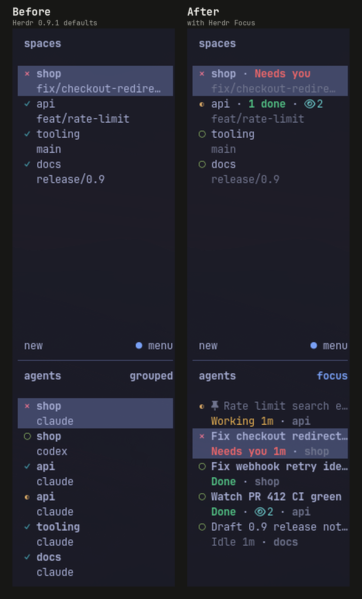
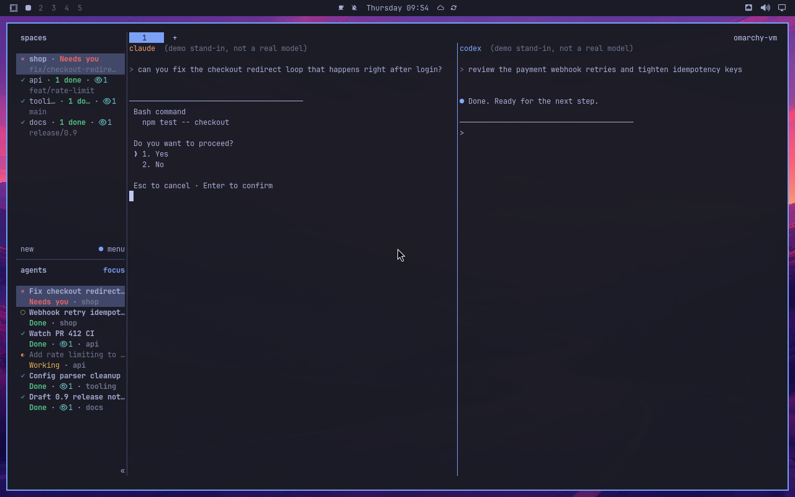

# Herdr Focus

A [Herdr](https://herdr.dev) plugin that makes the agent sidebar tell you what needs you.



- **Clear rows.** Each agent gets a short title and a status: **Needs you**, **Working 3m**,
  **Done**, **Unread** or **Idle**. Working rows fade; rows that need you stand out.
- **Watch eye 👁.** Shows while an agent's background watches run (PR checks, polling loops),
  even after the agent itself went idle. Dev servers don't count.
- **Triage.** Mark unread, settle (hide) finished work, snooze, pin, undo.
- **Workspace summary.** Spaces show `Needs you`, `2 done`, `Working` and the eye.
- **Titles.** The agent's own session title (Claude, Codex, OpenCode, Hermes), else the first
  prompt. Optionally from a model you pick.

Needs Herdr 0.9.1+ and Python 3.11+ (Linux, macOS).

## Install

```sh
curl -fsSL https://raw.githubusercontent.com/Zeus-Deus/herdr-focus/main/install.sh | sh
```

Run it again to update. It backs up `~/.config/herdr/config.toml` before adding its sidebar
rows and keys. If you already customised the sidebar or a key is taken, it leaves yours alone
and tells you.

## Uninstall

```sh
curl -fsSL https://raw.githubusercontent.com/Zeus-Deus/herdr-focus/main/install.sh | sh -s -- --uninstall
```

Removes the plugin, its config block and its state. Your other settings stay as they were.

## Keys

| Key | Does |
| --- | --- |
| `prefix+a` | open the menu: all agents, act on any of them |
| `prefix+u` | mark the current agent unread / read |
| `prefix+shift+s` | settle it (hide it from the list) / bring it back |
| `prefix+i` | jump to the next agent that needs you |
| `prefix+shift+u` | undo |

In the menu: `↑↓` pick, `enter` go to it, `u` unread, `s` settle, `z` snooze, `p` pin,
`w` watch, `r` rename, `g` new title, `h` show settled, `A` settle all idle, `U` undo, `q` close.

## How to use it

- A finished agent shows **Done** until you look at it. Opened one by accident? Press
  `prefix+u` to mark it unread again.
- Done with a result? Settle it (`prefix+shift+s`). It comes back on its own when the agent
  starts working again. Snooze hides it until a time you pick.
- You can't settle or snooze an agent that is working or waiting for you.
- Pin what you keep coming back to; it stays on top.
- The agent runs a watch you care about but the plugin can't see it? Press `w` in the menu
  for a manual watch eye.

## AI titles (optional)

Most agents name their sessions themselves, and Focus uses those names. For the rest you can
let a model write titles. Off by default, so nothing leaves your machine. Put this in
`$(herdr plugin config-dir focus)/config.toml` and run "Focus: reload config":

```toml
[titles]
backend = "command"
command = ["claude", "-p", "--model", "haiku", "--tools", "", "--no-session-persistence"]
```

The first prompt of each conversation (secrets redacted) goes to that command. A name you
set yourself always wins. More options: [config.example.toml](config.example.toml).

## Agents

Status and triage work for every agent Herdr detects. Titles and the watch eye read each
agent's own session files:

| Agent | Title | Watch eye |
| --- | --- | --- |
| Claude Code | its own session title | automatic: background commands, Monitor |
| Codex | its own thread name | automatic: background processes |
| OpenCode | its own session title | automatic: background subagents |
| Hermes | its own session title | automatic: background processes |
| Pi, Cursor, Copilot | their name for it, else the first prompt | manual (`w`) |
| Others | the terminal title | manual (`w`) |

Dev servers (`npm run dev` and friends) never count as watches.



## More

- [docs/behavior.md](docs/behavior.md): exact rules
- [docs/native-hooks.md](docs/native-hooks.md): what needs Herdr core support (right-click on agent rows)
- Tests: `python3 -m unittest discover -s tests -t . -p 'test_*.py'`
